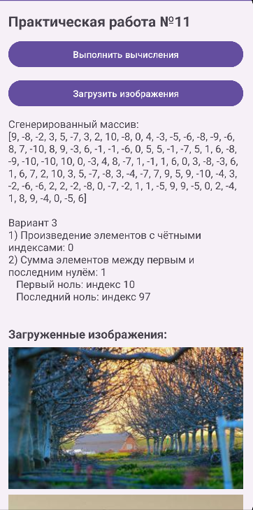

<div align="center">

# Отчет

</div>

<div align="center">

## Практическая работа №11

</div>

<div align="center">

## Многопоточность в Android. Асинхронная загрузка данных

</div>

**Выполнил:**
Майстренко Константин Александрович
**Группа:** инс-б-о-24-2

---

### Цель работы

Изучить принципы многопоточного программирования в Android. Научиться выносить длительные операции в фоновые потоки, чтобы избежать блокировки пользовательского интерфейса, а также освоить способы обновления UI из фоновых потоков.

### Ход работы

В ходе выполнения практической работы было создано Android-приложение, демонстрирующее работу с многопоточностью и асинхронной загрузкой данных.

Сначала был подготовлен интерфейс приложения. На главном экране были размещены кнопки для запуска длительных вычислений, загрузки изображений, индикатор прогресса `ProgressBar`, а также область для отображения результатов вычислений и загруженных изображений.

После этого была реализована демонстрация выполнения длительной операции в главном потоке. Для этого использовался метод с длительными вычислениями, который вызывался напрямую из обработчика кнопки. В результате можно было увидеть, что интерфейс приложения на время выполнения операции перестаёт отвечать на действия пользователя.

Затем аналогичная операция была вынесена в отдельный поток. Для этого использовался `Thread` или `ExecutorService`, благодаря чему длительные вычисления выполнялись в фоне, а интерфейс продолжал оставаться отзывчивым. После завершения вычислений результат передавался в главный поток и отображался на экране.

Далее была реализована загрузка изображений из интернета в фоновом потоке. Для этого использовалось разрешение `INTERNET`, а сами изображения загружались последовательно по URL-адресам. После загрузки каждого изображения обновлялся общий прогресс в `ProgressBar`, а затем изображение добавлялось на экран динамически с помощью новых `ImageView`.

При выполнении работы особое внимание уделялось правильному обновлению интерфейса из фонового потока. Для этого использовались методы `runOnUiThread()` или связка `Handler` и `Looper.getMainLooper()`, так как прямое изменение UI из фонового потока в Android запрещено.

Таким образом, в приложении были реализованы два основных направления работы: выполнение длительных вычислений в фоновом потоке и асинхронная загрузка данных из сети с отображением прогресса и результата на экране.

Ниже приведены скриншоты выполнения работы.

<div align="center">


*Рисунок 1. Интерфейс приложения и запуск фоновой задачи*

</div>

<div align="center">


*Рисунок 2. Отображение прогресса выполнения вычислений*

</div>

<div align="center">


*Рисунок 3. Итоговый результат вычислений и загруженных данных*

</div>

### Вывод

В результате выполнения практической работы были изучены основные принципы многопоточности в Android.
Я научился выносить длительные операции в фоновые потоки, избегать блокировки пользовательского интерфейса, а также корректно обновлять элементы UI после завершения фоновой работы.
Практическая работа позволила лучше понять, как организуется асинхронная обработка данных и загрузка ресурсов в Android-приложениях.

### Ответы на контрольные вопросы

1. **Что такое главный (UI) поток? Почему нельзя выполнять длительные операции в нём?**
   Главный поток — это основной поток Android-приложения, который отвечает за отрисовку интерфейса и обработку пользовательских действий.
   Если выполнять в нём длительные операции, интерфейс перестаёт отвечать на нажатия и может «зависнуть». Поэтому такие задачи нужно выносить в фоновые потоки.

2. **Что такое ANR (Application Not Responding)? При каких условиях возникает?**
   `ANR` — это состояние, при котором приложение слишком долго не отвечает на действия пользователя.
   Обычно это происходит, если главный поток заблокирован длительной операцией примерно на 5 секунд и более.

3. **Как создать новый поток в Java? Как запустить выполнение кода в этом потоке?**
   Новый поток можно создать с помощью класса `Thread`.
   Пример:

   ```java
   Thread thread = new Thread(new Runnable() {
       @Override
       public void run() {
           // код, выполняемый в фоне
       }
   });
   thread.start();
   ```

   Метод `start()` запускает выполнение кода в новом потоке.

4. **Почему нельзя обновлять UI из фонового потока напрямую? Как правильно обновить интерфейс из другого потока?**
   В Android элементы интерфейса можно изменять только из главного потока.
   Если попытаться обновить UI из фонового потока напрямую, приложение может завершиться с ошибкой.
   Правильный способ — использовать `runOnUiThread()`, `Handler` или другие механизмы возврата в UI-поток.

5. **Для чего используется класс Handler? Как с его помощью отправить сообщение в UI-поток?**
   `Handler` используется для отправки задач и сообщений в определённый поток, чаще всего в главный UI-поток.
   Пример:

   ```java
   Handler handler = new Handler(Looper.getMainLooper());
   handler.post(new Runnable() {
       @Override
       public void run() {
           textView.setText("Готово");
       }
   });
   ```

   В этом случае код внутри `post()` выполнится в главном потоке.

6. **Что такое ExecutorService? В чём его преимущество перед созданием потоков вручную?**
   `ExecutorService` — это инструмент для управления пулом потоков.
   Его преимущество в том, что он позволяет не создавать потоки вручную для каждой задачи, а использовать уже готовый пул, что делает код более удобным, управляемым и эффективным.

7. **Почему AsyncTask считается устаревшим? Какие альтернативы рекомендуется использовать?**
   `AsyncTask` считается устаревшим, потому что он имеет ограничения, плохо управляется при изменении жизненного цикла активности и не подходит для современных приложений.
   Вместо него рекомендуется использовать `ExecutorService`, `Handler`, `WorkManager`, а в Kotlin — `Coroutines`.

8. **Как отобразить прогресс выполнения длительной операции с помощью ProgressBar?**
   Для этого на экране размещается `ProgressBar`, после чего во время выполнения задачи ему задаётся текущее значение прогресса через `setProgress()`.
   Перед началом задачи его можно показать через `setVisibility(View.VISIBLE)`, а после завершения скрыть через `setVisibility(View.GONE)`.

### Список литературы

1. Phillips, B., Stewart, K., & Marsicano, K. *Android Programming: The Big Nerd Ranch Guide* (5th Edition). Big Nerd Ranch Guides, 2022.
2. Документация Android Developers. Руководство по процессам и потокам в Android.
3. Гриффитс Д., Гриффитс Д. *Head First. Программирование для Android*. Питер, 2021.
4. Соколова В. В. *Разработка мобильных приложений на платформе Android*. М.: Юрайт, 2021.
5. Мэрфи М. *Основы Android программирования на Java*. СПб.: БХВ-Петербург, 2019.
